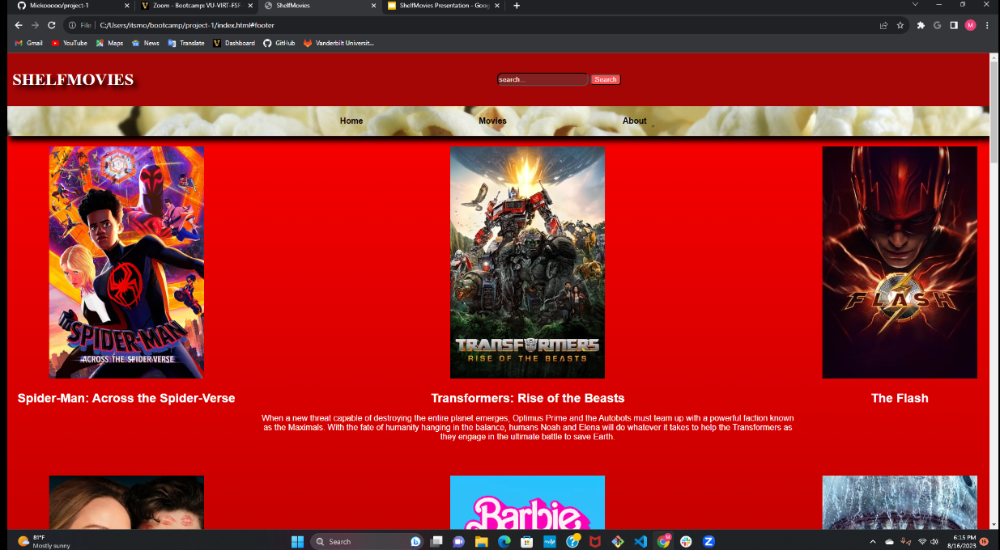
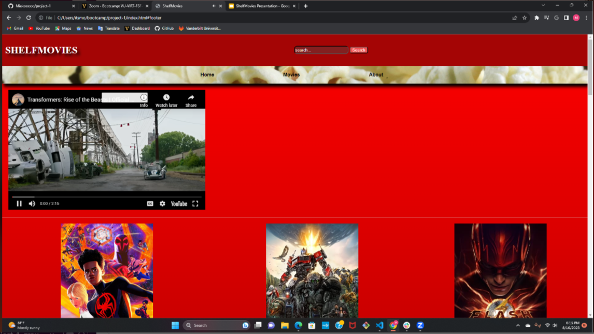

# project-1
ShelfMovies
   A simple movie website

## Website link
-Deployed -  https://miekooooo.github.io/project-1/
-GitHub repo - https://github.com/Miekooooo/project-1

## Instructions
1.Launch website
2.Find a movie either by skimming through the selection or through the search bar.
3.Once a movie is found hover over the poster to get the movie’s name and information
4.Click the poster to play the trailer through the Youtube player

## Description
- This is a simple movie API project that allows users to search for movies and retrieve details and trailer about them. The project is built using HTML, CSS, and JavaScript, and it utilizes a two third-party movie APIs to fetch movie data.

- MOTIVATION
We created this project as a way to practice our skills in working with APIs and asynchronous JavaScript. We wanted to build a simple and user-friendly interface that allows users to search for movies and get relevant information quickly and efficiently.
- WHY BUILD THIS PROJECT?
Our main goal as a team was for this project to provide users with an easy-to-use tool to search for movie information and trailer. With so many movies available, it can be overwhelming to keep track of all the details. This project aims to solve that problem by offering a simple and convenient way to access movie data.
- PROBLEM SOLVED 
This project addresses the problem of finding detailed information about movies without having to navigate through various websites or applications. By using this movie API, users can get instant access to movie titles, release dates, plot summaries, and more.
-WHAT We Learned
Through this project, I learned how to make API requests using JavaScript's fetch() function and handle the asynchronous nature of these requests. I also gained experience in parsing and displaying JSON data in a user-friendly manner on a web page. Additionally, I improved my HTML and CSS skills by creating a clean and responsive design for the project.

## Features

-Search for movies using keywords
-Display movie details such as title, release date, and plot summary
-Responsive design that works well on various screen sizes
-User-friendly interface with clear search results

## Screenshots

## Usage
What technologies were used?
 - TMDB API along with Youtube IFrame API

## Credits
-http://www.moviedb.org/
-http://www.youtube.com/

## License 

MIT License

Copyright (c) [2023] []

Permission is hereby granted, free of charge, to any person obtaining a copy
of this software and associated documentation files (the "Software"), to deal
in the Software without restriction, including without limitation the rights
to use, copy, modify, merge, publish, distribute, sublicense, and/or sell
copies of the Software, and to permit persons to whom the Software is
furnished to do so, subject to the following conditions:

The above copyright notice and this permission notice shall be included in all
copies or substantial portions of the Software.

THE SOFTWARE IS PROVIDED "AS IS", WITHOUT WARRANTY OF ANY KIND, EXPRESS OR
IMPLIED, INCLUDING BUT NOT LIMITED TO THE WARRANTIES OF MERCHANTABILITY,
FITNESS FOR A PARTICULAR PURPOSE AND NONINFRINGEMENT. IN NO EVENT SHALL THE
AUTHORS OR COPYRIGHT HOLDERS BE LIABLE FOR ANY CLAIM, DAMAGES OR OTHER
LIABILITY, WHETHER IN AN ACTION OF CONTRACT, TORT OR OTHERWISE, ARISING FROM,
OUT OF OR IN CONNECTION WITH THE SOFTWARE OR THE USE OR OTHER DEALINGS IN THE
SOFTWARE.